{: width=350px} 
# Molecular Clustering and Analysis Toolkit

[](https://www.python.org/)
[](https://opensource.org/licenses/MIT)

MolPrism is a flexible, high-performance command-line tool designed for the clustering and analysis of molecular datasets. It empowers researchers and data scientists to explore chemical libraries, identify structurally similar compound groups, and select representative molecules for further study.

The tool is built with a modular architecture, allowing for easy extension with new algorithms and analysis methods.

## Key Features

- **Multiple Clustering Algorithms**: Natively supports `KMeans`, `DBSCAN`, and `Agglomerative` clustering. The modular design makes it easy to add more.
- **Automatic K-Value Optimization**: For KMeans, MolPrism can automatically determine the optimal number of clusters (`k`) by analyzing both the Elbow method and Silhouette scores.
- **Custom Feature Selection**: Users can specify exactly which molecular descriptors (columns) from the input file should be used for clustering.
- **Representative Molecule Selection**: Automatically extracts a specified number of representative molecules from each cluster. For KMeans, it selects molecules nearest to the cluster centroid. For other algorithms, it identifies cluster medoids.
- **Parallel Processing**: Leverages multiple CPU cores for computationally intensive tasks (e.g., finding the best `k`), significantly speeding up analysis.
- **Rich Visualization & Reporting**: Generates 2D PCA plots for intuitive visualization of clusters and exports detailed results into comprehensive CSV files.
- **Flexible Configuration**: Run analyses using command-line arguments or a YAML configuration file, with command-line arguments taking precedence.

## Installation

Follow these steps to set up and run MolPrism. A `conda` environment is recommended to manage dependencies.

### 1. Clone the Repository

First, clone the project from GitHub to your local machine:

```bash
git clone https://github.com/cemuguz-lab/MolPrism.git
cd MolPrism
```

### 2. Create and Activate the Conda Environment

Create a dedicated environment for MolPrism to avoid conflicts with other projects. We recommend Python 3.9 or newer.

```bash
# Create the environment named 'molprism_env'
conda create --name molprism_env python=3.9 -y

# Activate the new environment
conda activate molprism_env
```

### 3. Install Dependencies

Install all the required Python libraries from the `requirements.txt` file using `pip`.

```bash
pip install -r requirements.txt
```

### 4. Install MolPrism in Editable Mode (for Development/Testing)

For development or running tests, it's recommended to install MolPrism in editable mode. This allows Python to find the `molprism` package correctly.

```bash
pip install -e .
```
You are now ready to use MolPrism!

## Workflow Diagram

The following diagram illustrates the overall workflow of MolPrism, from input to output, including the different algorithmic paths.

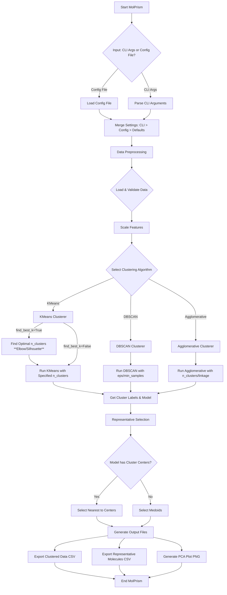
```mermaid
graph TD
    A[Start MolPrism] --> B{Input: CLI Args or Config File?};

    B -- Config File --> C[Load Config File];
    B -- CLI Args --> D[Parse CLI Arguments];

    C --> E[Merge Settings: CLI > Config > Defaults];
    D --> E;

    E --> F[Data Preprocessing];
    F --> G{Load & Validate Data}; 
    G --> H[Scale Features];

    H --> I{Select Clustering Algorithm}; 

    I -- KMeans --> J[KMeans Clusterer];
    J -- find_best_k=True --> K[Find Optimal n_clusters **Elbow/Silhouette**];
    K --> L[Run KMeans with Optimal n_clusters];
    J -- find_best_k=False --> L[Run KMeans with Specified n_clusters];

    I -- DBSCAN --> M[DBSCAN Clusterer];
    M --> N[Run DBSCAN with eps/min_samples];

    I -- Agglomerative --> O[Agglomerative Clusterer];
    O --> P[Run Agglomerative with n_clusters/linkage];

    L --> Q[Get Cluster Labels & Model];
    N --> Q;
    P --> Q;

    Q --> R[Representative Selection];
    R --> S{Model has Cluster Centers?}; 
    S -- Yes --> T[Select Nearest to Centers];
    S -- No --> U[Select Medoids];

    T --> V[Generate Output Files];
    U --> V;

    V --> W[Export Clustered Data CSV];
    V --> X[Export Representative Molecules CSV];
    V --> Y[Generate PCA Plot PNG];

    W --> Z[End MolPrism];
X --> Z;
Y --> Z;
```

## Parameter Selection Guide

Choosing the right parameters is crucial for effective clustering and meaningful results. This guide provides brief explanations and considerations for selecting values for MolPrism's key parameters.

### Input & Output Settings

*   **`input_file`**: Path to your input CSV data.
    *   **Considerations**: Ensure the file exists and is accessible. It should contain molecular descriptors and unique identifiers (like `IDNUMBER`).
*   **`output_dir`**: Directory where all generated files (CSV results, plots) will be saved.
    *   **Considerations**: Choose a clear, descriptive path. MolPrism will create this directory if it doesn't exist.
*   **`features`**: A list of column names from your input CSV that represent the molecular descriptors to be used for clustering.
    *   **Considerations**:
        *   **Relevance**: Select features that are relevant to the chemical properties you want to cluster by (e.g., physicochemical properties, topological descriptors, fingerprints).
        *   **Data Type**: Ensure these columns contain numeric data. MolPrism will attempt to convert them, but non-numeric values will be dropped.
        *   **Impact**: The choice of features profoundly impacts the clustering outcome. Different feature sets will highlight different aspects of molecular similarity. For example, `TPSA` and `MW` might group molecules by size and polarity, while `nHBDon` and `nHBAcc` might group them by hydrogen bonding capacity.

### Algorithm Settings

*   **`algorithm`**: The clustering algorithm to use. Options: `kmeans`, `dbscan`, `agglomerative`.
    *   **Considerations**:
        *   **`kmeans`**: Good for spherical, well-separated clusters. Fast and scalable. Requires specifying `n_clusters` or using `find_best_k`.
        *   **`dbscan`**: Excellent for finding density-based, arbitrarily shaped clusters and identifying noise. Does not require `n_clusters`. Sensitive to `eps` and `min_samples`.
        *   **`agglomerative`**: Creates hierarchical clusters. Useful for understanding relationships between clusters. Can be computationally intensive for very large datasets.
*   **`n_representatives`**: Number of representative molecules to select from each cluster.
    *   **Considerations**:
        *   **Purpose**: These molecules are typically the "most central" or "most typical" for their cluster.
        *   **Value**: A smaller number (e.g., 5-20) is good for quick overview and experimental validation. A larger number might be needed for more comprehensive sampling.
        *   **Impact**: Directly affects the size of the `_representatives.csv` file.

### Algorithm-Specific Parameters

These parameters are specific to the chosen clustering algorithm.

#### KMeans Parameters (`kmeans_params`)

*   **`n_clusters`**: The desired number of clusters.
    *   **Considerations**:
        *   **Domain Knowledge**: Often guided by prior knowledge of the dataset or biological context.
        *   **Optimization**: If `find_best_k` is `true`, this value is ignored, as MolPrism will determine it automatically.
*   **`find_best_k`**: Set to `true` to automatically determine the optimal `n_clusters` using Elbow and Silhouette methods.
    *   **Considerations**: Recommended when `n_clusters` is unknown. Can be computationally intensive for very large datasets or wide `min_k`/`max_k` ranges.
*   **`min_k` / `max_k`**: The range to search for the optimal `n_clusters` when `find_best_k` is `true`.
    *   **Considerations**: Define a reasonable range based on your data size and expected cluster count. A wider range increases computation time.

#### DBSCAN Parameters (`dbscan_params`)

*   **`eps` (epsilon)**: The maximum distance between two samples for one to be considered as in the neighborhood of the other.
    *   **Considerations**:
        *   **Density**: Crucial for defining cluster density. Too small, and many points will be noise. Too large, and distinct clusters might merge.
        *   **Data Scale**: Highly dependent on the scale of your features. Since MolPrism standardizes features, `eps` values typically range from `0.1` to `2.0`.
        *   **Rule of Thumb**: A common approach is to plot the k-distance graph (distance to k-th nearest neighbor) and look for an "elbow" point.
*   **`min_samples`**: The number of samples (or total weight) in a neighborhood for a point to be considered as a core point.
    *   **Considerations**:
        *   **Noise Tolerance**: Higher values make the algorithm more robust to noise but might cause smaller clusters to be labeled as noise.
        *   **Minimum Cluster Size**: Effectively sets the minimum size for a cluster. A common starting point is `2 * number_of_features`.

#### Agglomerative Parameters (`agglomerative_params`)

*   **`n_clusters`**: The desired number of clusters.
    *   **Considerations**: Similar to KMeans, often guided by domain knowledge. Can be determined by inspecting a dendrogram (though MolPrism doesn't generate dendrograms directly).
*   **`linkage`**: The linkage criterion to use. Options: `ward`, `complete`, `average`, `single`.
    *   **Considerations**: Defines how the distance between two clusters is calculated.
        *   **`ward`**: Minimizes the variance of the clusters being merged. Tends to produce spherical clusters.
        *   **`complete`**: Uses the maximum distance between observations of pairs of clusters. Tends to produce compact clusters.
        *   **`average`**: Uses the average of the distances of each observation of the two sets.
        *   **`single`**: Uses the minimum distance between observations of pairs of clusters. Can produce "chaining" effects.
        *   **Recommendation**: `ward` is often a good default for general-purpose clustering.

### Performance Settings

*   **`n_jobs`**: Number of CPU cores to use for parallelized tasks (`-1` means use all available cores).
    *   **Considerations**:
        *   **Speed**: Higher values can significantly speed up computation for parallelizable tasks (like `find_best_k`).
        *   **Resource Usage**: Setting to `-1` will use all available cores, which might consume significant CPU resources. Adjust based on your system's capabilities and other running processes.


MolPrism is run from the command line. The main entry point is `molprism/cli.py`.

**Basic Command Structure:**
```bash
python molprism/cli.py --input_file <path_to_data.csv> --output_dir <path_to_output_folder> --features <feature_1> <feature_2> ... [OPTIONS]
```

**Using a Configuration File:**
Alternatively, you can specify all parameters in a YAML configuration file. This is especially useful for complex runs or for reproducibility.

```bash
python molprism/cli.py --config path/to/your_config.yaml
```

**Note:** Command-line arguments will always override settings provided in the configuration file.

---

### Example Scenarios

The parameter values used in these examples are illustrative and may not be optimal for your specific dataset. Users are encouraged to experiment with different parameters and refer to the 'Parameter Selection Guide' for more detailed guidance.

Here are comprehensive examples demonstrating how to run MolPrism for various clustering tasks.

#### 1. KMeans with Automatic `n_clusters` Detection
This is the recommended approach for KMeans if you are unsure how many clusters to create. The tool will find the optimal `n_clusters` for you based on Elbow and Silhouette methods.

```bash
conda run -n molprism_env python molprism/cli.py \
    --input_file data/first_run_50000.csv \
    --output_dir output/kmeans_auto_n_clusters \
    --features TPSA MW SLogP NumRings \
    --algorithm kmeans \
    --find_best_k \
    --n_representatives 20 \
    --n_jobs -1
```

#### 2. KMeans with a Specific Number of Clusters
If you already know the desired number of clusters, you can specify it directly with the `--n_clusters` argument.

```bash
conda run -n molprism_env python molprism/cli.py \
    --input_file data/first_run_50000.csv \
    --output_dir output/kmeans_n_clusters_5 \
    --features TPSA MW SLogP NumRings \
    --algorithm kmeans \
    --n_clusters 5 \
    --n_representatives 15 \
    --n_jobs -1
```

#### 3. DBSCAN Clustering
To use DBSCAN, select it with the `--algorithm` flag and provide algorithm-specific parameters like `--eps` and `--min_samples`.

```bash
conda run -n molprism_env python molprism/cli.py \
    --input_file data/first_run_50000.csv \
    --output_dir output/dbscan_run \
    --features TPSA MW SLogP \
    --algorithm dbscan \
    --eps 0.75 \
    --min_samples 10 \
    --n_representatives 5 \
    --n_jobs -1
```

#### 4. Agglomerative Clustering
To use Agglomerative (Hierarchical) Clustering, you must specify the number of clusters with `--n_clusters`. You can also choose a `linkage` method.

```bash
conda run -n molprism_env python molprism/cli.py \
    --input_file data/first_run_50000.csv \
    --output_dir output/agglomerative_run \
    --features TPSA NumRings \
    --algorithm agglomerative \
    --n_clusters 8 \
    --linkage "ward" \
    --n_representatives 10 \
    --n_jobs -1
```

#### 5. Running with a Configuration File
For more complex setups or for reproducibility, you can use a YAML configuration file. An example template is provided as `config.template.yaml`.

First, copy and modify the template:
```bash
cp config.template.yaml config.yaml
# Open config.yaml in your favorite editor and adjust settings
```

Then, run MolPrism using the config file:
```bash
conda run -n molprism_env python molprism/cli.py --config config.yaml
```

**Note:** You can still override specific settings from the config file by providing them as command-line arguments. For example:
```bash
conda run -n molprism_env python molprism/cli.py --config config.yaml --output_dir output/my_custom_run --n_representatives 50
```


## Understanding Output Files with Examples

For each successful run, MolPrism will generate the following files in your specified output directory. These examples demonstrate various clustering strategies and feature sets, where algorithm-specific parameters are randomly selected to explore diverse outcomes.

### Common Output Files

*   **`*_results_all.csv`**: This file contains your original dataset with an additional `Cluster` column, indicating the assigned cluster for each molecule. This allows you to see the full context of your clustered data.
*   **`*_results_representatives.csv`**: This file contains a subset of molecules, specifically the representative molecules selected from each cluster. These are typically the molecules closest to the cluster centers (for KMeans) or medoids (for DBSCAN/Agglomerative), providing a concise overview of each cluster's characteristics.
*   **`*_results.png`**: This is a 2D PCA plot visualizing the clusters. Each point represents a molecule, colored by its assigned cluster. This plot helps in quickly understanding the separation and distribution of clusters in the feature space.

---

### Example Scenarios from `output` Directory

Here are comprehensive examples demonstrating how MolPrism generates output for various clustering tasks, reflecting the runs in your `output` directory.

#### 1. KMeans with Automatic `n_clusters` Detection (Default Features)

**Output Directory**: `md_images/run_from_config_kmeans_find_best_true`
**Features Used**: `TPSA`, `MW`, `SLogP`, `NumRings`

**Example `kmeans_results_all.csv` content:**
```csv
TPSA,MW,SLogP,NumRings,IDNUMBER,Canonical_SMILES,Cluster
181.01270832669348,495.98745912400045,1.9042,4,L475_0251,Cn1c(=O)sc2cc(S(=O)(=O)N3CCN(C(=O)c4cncc(Br)c4)CC3)ccc21,0
84.6420294400692,466.0640525680005,4.102700000000002,4,4428_0033,COC(=O)C1=C(C)NC(=O)NC1c1cn(-c2ccccc2)nc1-c1ccc(Br)cc1,2
62.04136813400241,370.2004906920007,3.288400000000002,4,Z1849261656,CCc1cccnc1C(=O)N1CCCCC1c1nnc(C2CCOCC2)o1,4
160.24778260712722,364.16075112000055,-0.8934999999999991,3,AG_205_13184012,CCOC(=O)c1nnn(-c2nonc2N)c1CN1CCC(C(N)=O)CC1,1
```

**Example `kmeans_results_representatives.csv` content:**
```csv
TPSA,MW,SLogP,NumRings,IDNUMBER,Canonical_SMILES,Cluster
144.81230653334617,416.13183975200064,3.365020000000002,4,SA58_0291,Cc1cc(S(=O)(=O)N2CCCC2CCc2noc(-c3cccnc3)n2)ccc1F,0
144.15912836855424,425.0349379240004,3.4373000000000022,4,AG_690_12949028,O=C1NC(=O)N(c2ccc(Cl)cc2)C(=O)/C1=C\Nc1nnc(-c2ccccc2)s1,0
142.57503337032222,423.1794209000007,3.192000000000002,4,AN_355_12337004,CCOC(=O)[C@H]1N[C@@H](c2ccc(OC)cc2)[C@H]([N+](=O)[O-])[C@H]1c1cn(C)c2ccccc12,0
142.22833207232827,427.1267166320005,3.251900000000002,4,AG_650_41069162,COC1(OC)OC2=C(C(=O)c3ccccc32)C(c2ccc([N+](=O)[O-])cc2)C1(OC)OC,0
```

**Visualization**:
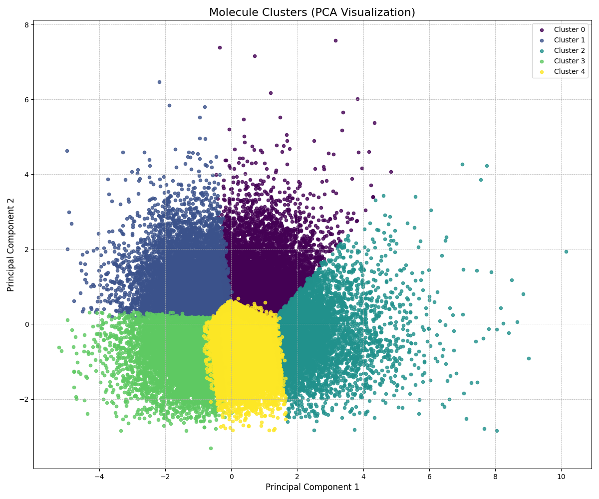

---

#### 2. KMeans with Automatic `n_clusters` Detection (Different Features)

**Output Directory**: `md_images/run_from_config_kmeans_diffFeatures_find_best_true`
**Features Used**: `AromaticRings`, `MinPartialCharge`, `BalabanJ`, `NumRings`, `nHBDon`, `nHBAcc`, `nRot`

*(Note: Example CSV content and image path will be similar to the above, but with different feature columns and potentially different clustering results due to the change in features.)*

**Visualization**:
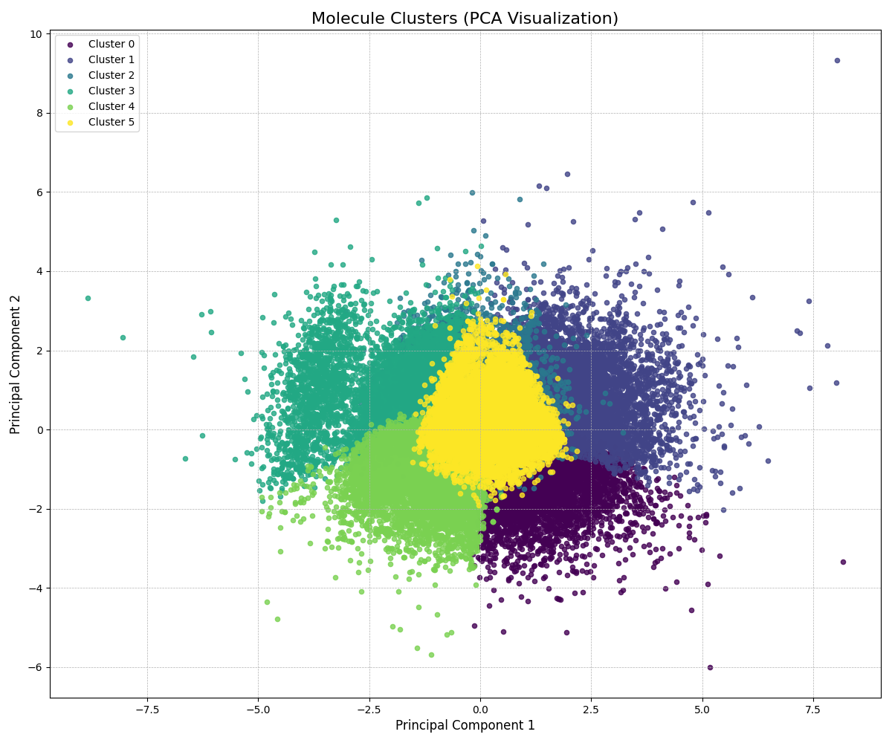

---

#### 3. KMeans with Specific `n_clusters` (Default Features)

**Output Directory**: `md_images/run_from_config_kmeans_find_best_false`
**Features Used**: `TPSA`, `MW`, `SLogP`, `NumRings`

*(Note: Example CSV content and image path will be similar to the above, but with potentially different clustering results due to the fixed number of clusters.)*

**Visualization**:
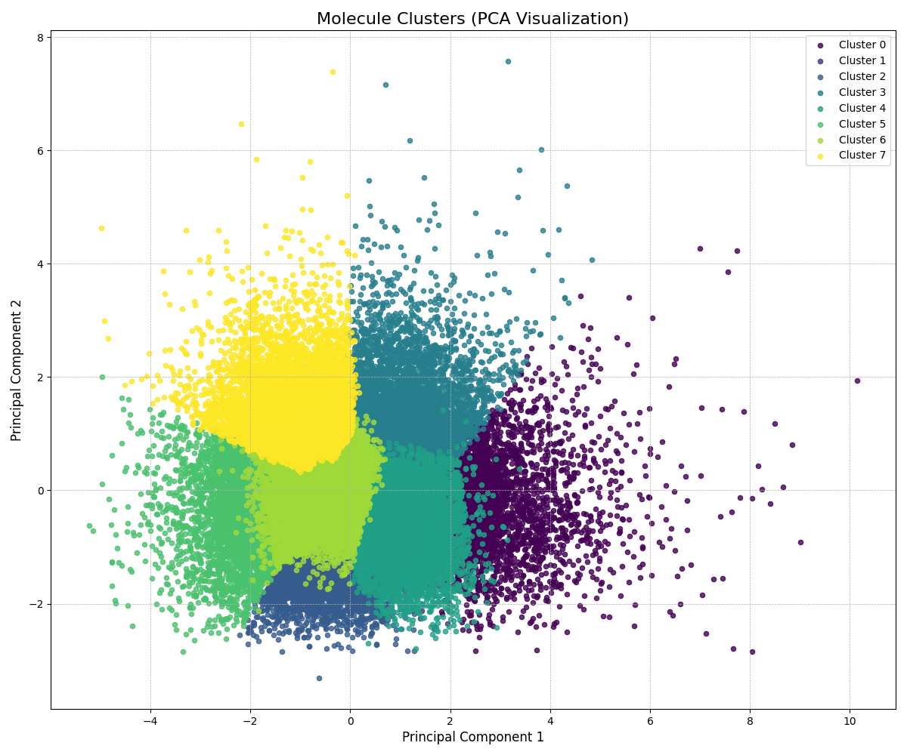

---

#### 4. KMeans with Specific `n_clusters` (Different Features)

**Output Directory**: `md_images/run_from_config_kmeans_diffFeatures_find_best_false`
**Features Used**: `AromaticRings`, `MinPartialCharge`, `BalabanJ`, `NumRings`, `nHBDon`, `nHBAcc`, `nRot`

*(Note: Example CSV content and image path will be similar to the above, but with different feature columns and potentially different clustering results.)*

**Visualization**:
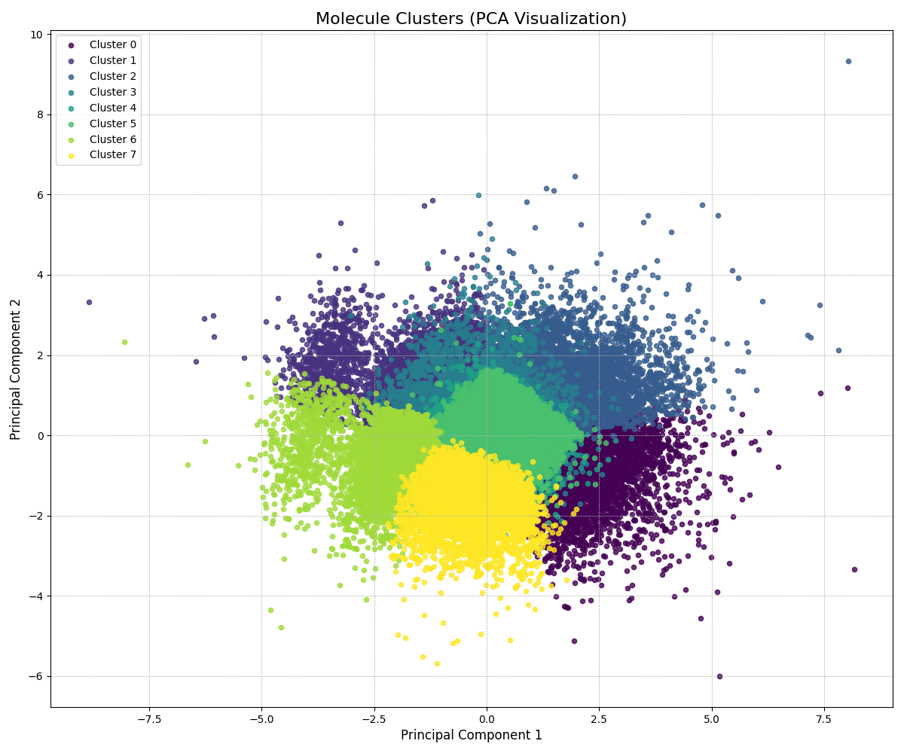

---

#### 5. DBSCAN Clustering (Default Features)

**Output Directory**: `md_images/run_from_config_dbscan`
**Features Used**: `TPSA`, `MW`, `SLogP`, `NumRings`

*(Note: DBSCAN output files will be named `dbscan_results_all.csv`, `dbscan_results_representatives.csv`, and `dbscan_results.png`.)*

**Visualization**:
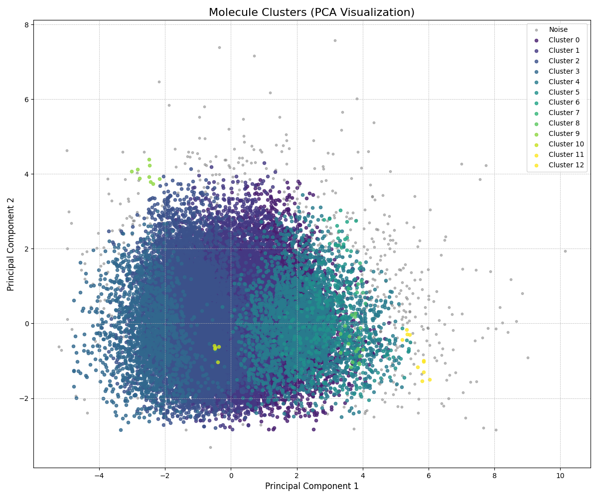

---

#### 6. DBSCAN Clustering (Different Features)

**Output Directory**: `md_images/run_from_config_dbscan_diffFeatures`
**Features Used**: `AromaticRings`, `MinPartialCharge`, `BalabanJ`, `NumRings`, `nHBDon`, `nHBAcc`, `nRot`

*(Note: Example CSV content and image path will be similar to the above, but with different feature columns and potentially different clustering results.)*

**Visualization**:
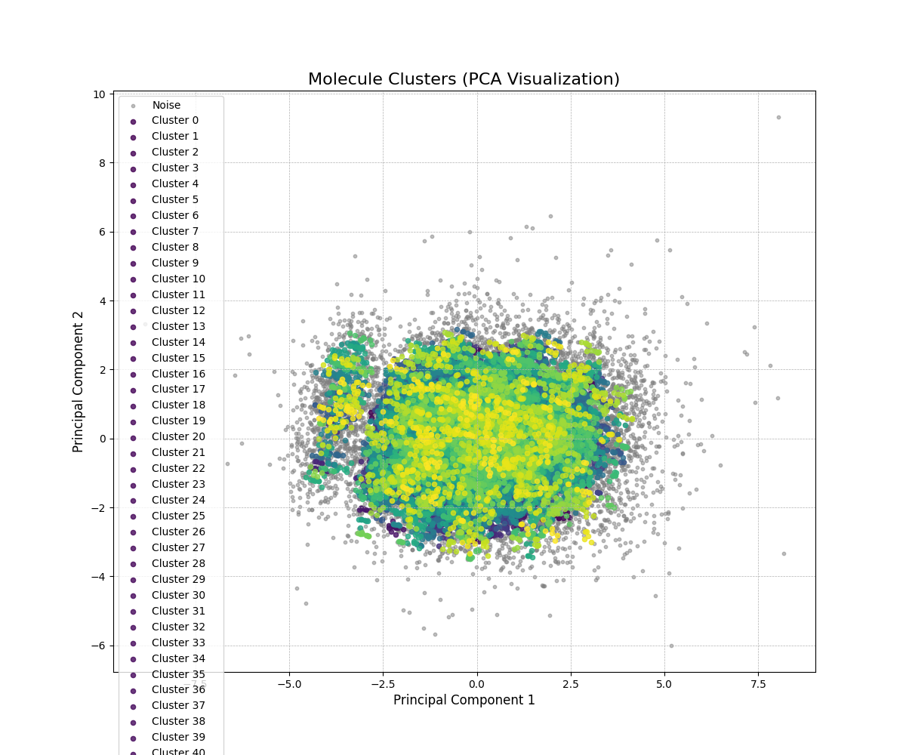

---

#### 7. Agglomerative Clustering (Default Features - Ward Linkage)

**Output Directory**: `md_images/run_from_config_agglomerative_ward`
**Features Used**: `TPSA`, `MW`, `SLogP`, `NumRings`

*(Note: Agglomerative output files will be named `agglomerative_results_all.csv`, `agglomerative_results_representatives.csv`, and `agglomerative_results.png`.)*

**Visualization**:
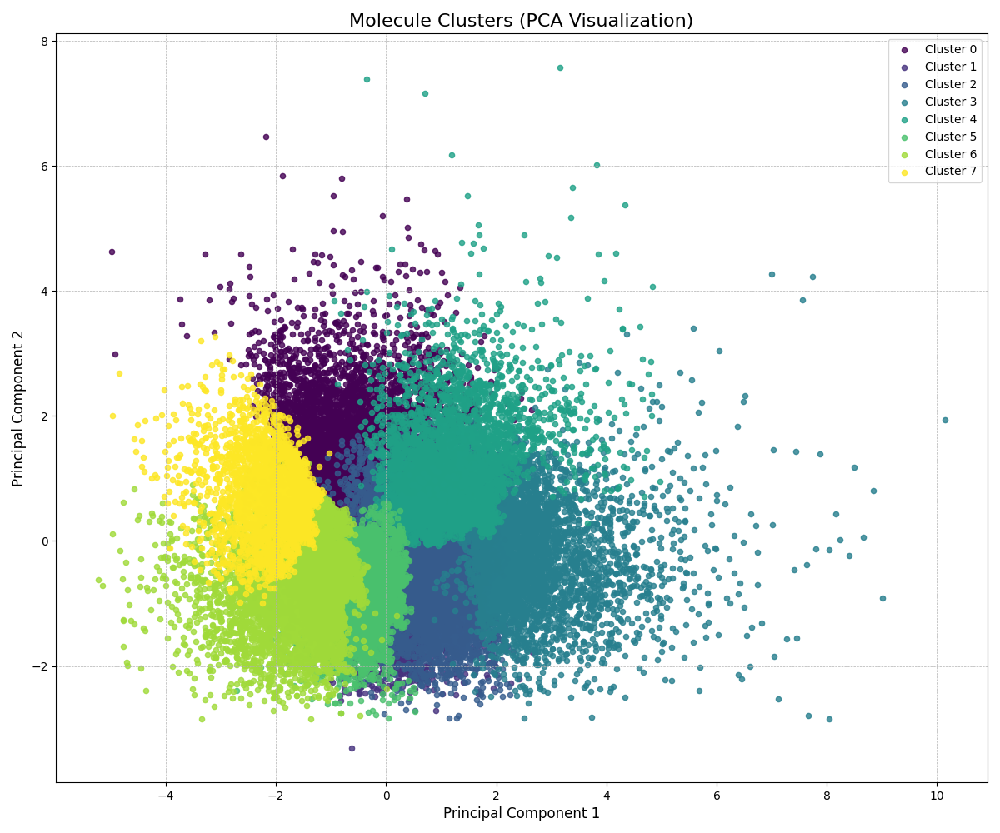

---

#### 8. Agglomerative Clustering (Default Features - Complete Linkage)

**Output Directory**: `md_images/run_from_config_agglomerative_complete`
**Features Used**: `TPSA`, `MW`, `SLogP`, `NumRings`

**Visualization**:
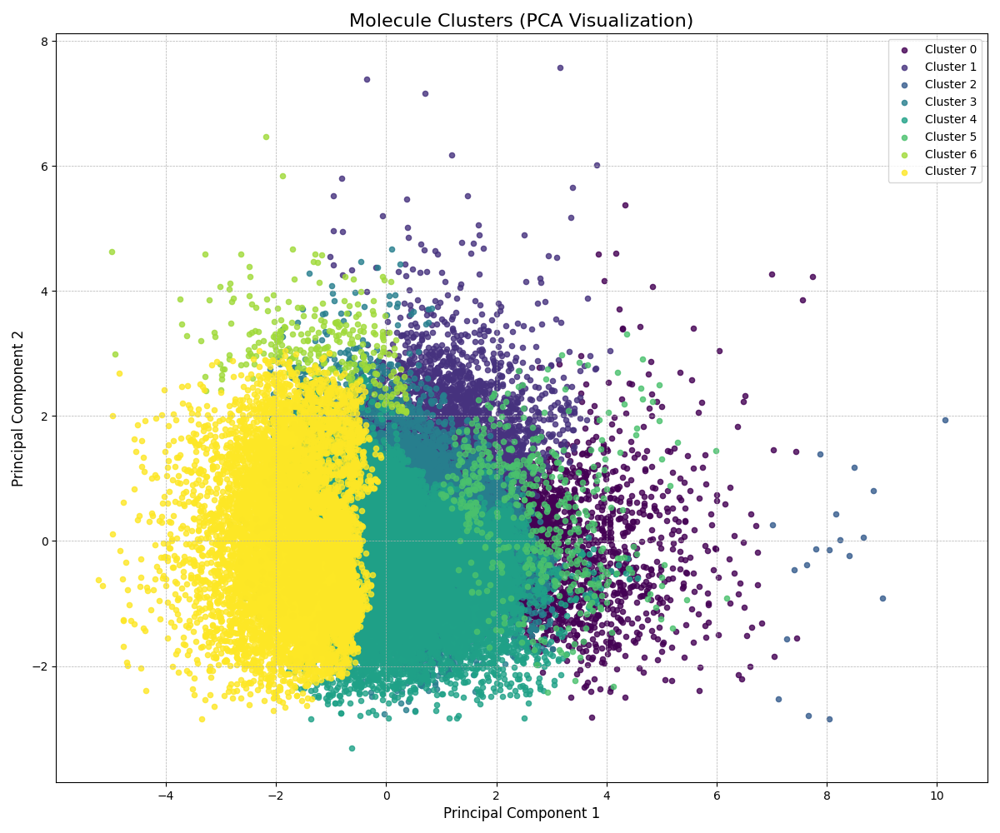

---

#### 9. Agglomerative Clustering (Default Features - Average Linkage)

**Output Directory**: `md_images/run_from_config_agglomerative_average`
**Features Used**: `TPSA`, `MW`, `SLogP`, `NumRings`

**Visualization**:
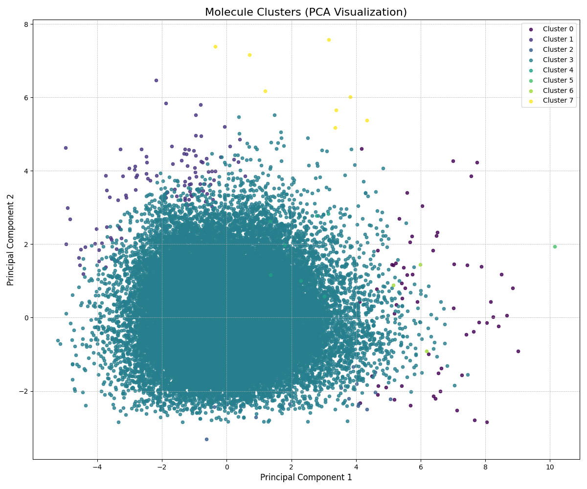

---

#### 10. Agglomerative Clustering (Default Features - Single Linkage)

**Output Directory**: `md_images/run_from_config_agglomerative_single`
**Features Used**: `TPSA`, `MW`, `SLogP`, `NumRings`

**Visualization**:
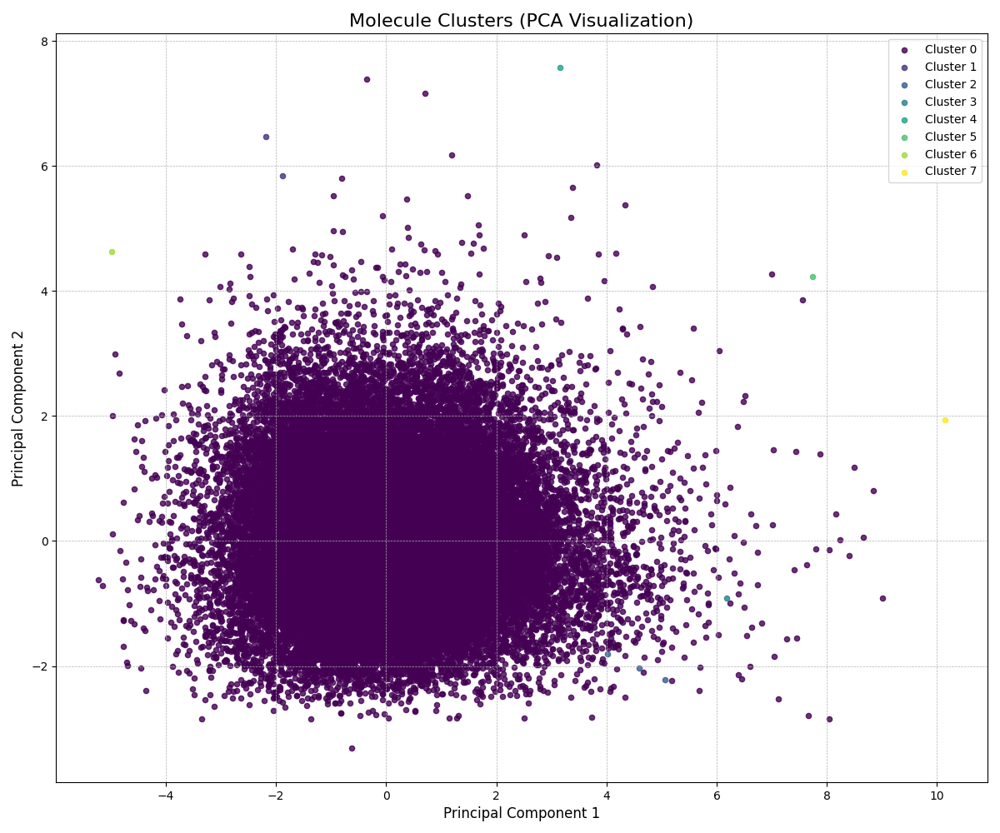

---

#### 11. Agglomerative Clustering (Different Features - Ward Linkage)

**Output Directory**: `md_images/run_from_config_agglomerative_ward_diffFeatures`
**Features Used**: `AromaticRings`, `MinPartialCharge`, `BalabanJ`, `NumRings`, `nHBDon`, `nHBAcc`, `nRot`

**Visualization**:
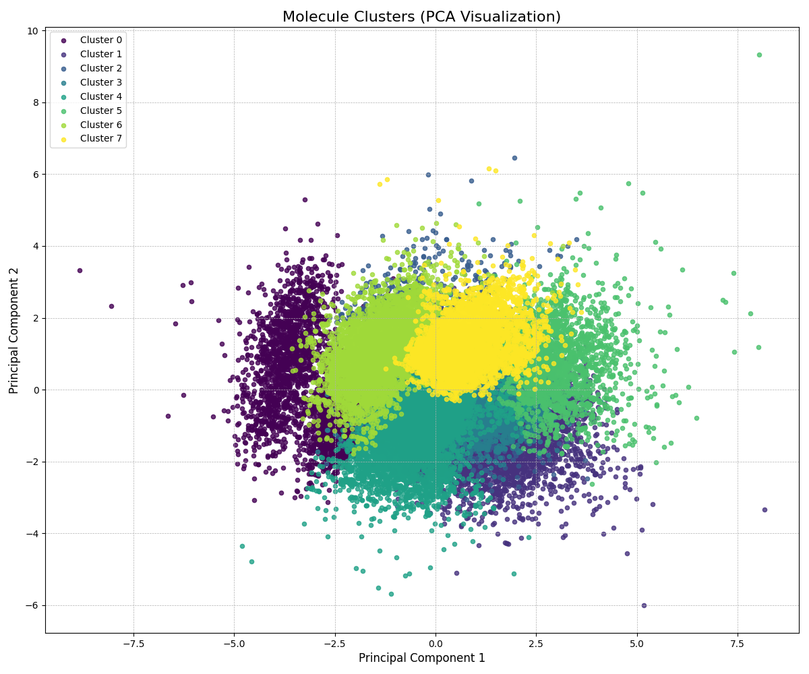

---

#### 12. Agglomerative Clustering (Different Features - Complete Linkage)

**Output Directory**: `md_images/run_from_config_agglomerative_complete_diffFeatures`
**Features Used**: `AromaticRings`, `MinPartialCharge`, `BalabanJ`, `NumRings`, `nHBDon`, `nHBAcc`, `nRot`

**Visualization**:
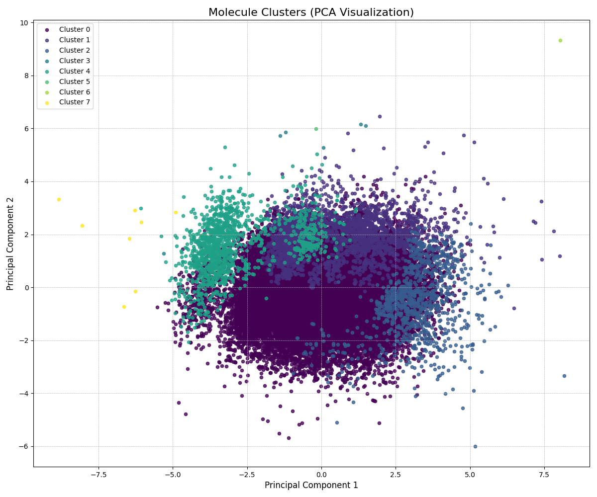

---

#### 13. Agglomerative Clustering (Different Features - Average Linkage)

**Output Directory**: `md_images/run_from_config_agglomerative_average_diffFeatures`
**Features Used**: `AromaticRings`, `MinPartialCharge`, `BalabanJ`, `NumRings`, `nHBDon`, `nHBAcc`, `nRot`

**Visualization**:
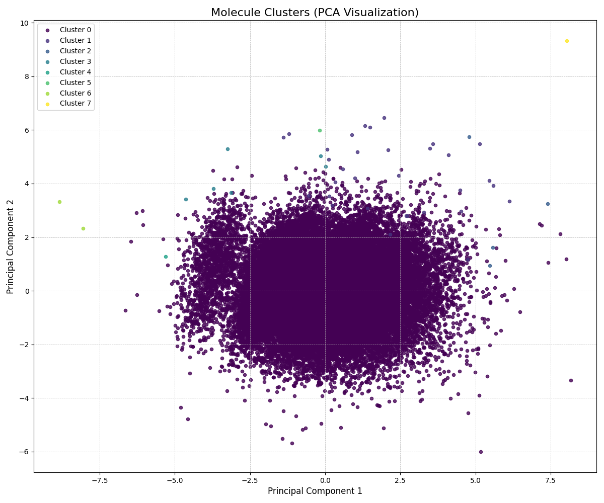

---

#### 14. Agglomerative Clustering (Different Features - Single Linkage)

**Output Directory**: `md_images/run_from_config_agglomerative_single_diffFeatures`
**Features Used**: `AromaticRings`, `MinPartialCharge`, `BalabanJ`, `NumRings`, `nHBDon`, `nHBAcc`, `nRot`

**Visualization**:


## Contributing

Contributions are welcome! If you have ideas for new features, algorithms, or improvements, please open an issue or submit a pull request.

## License

This project is licensed under the MIT License. See the `LICENSE` file for details.